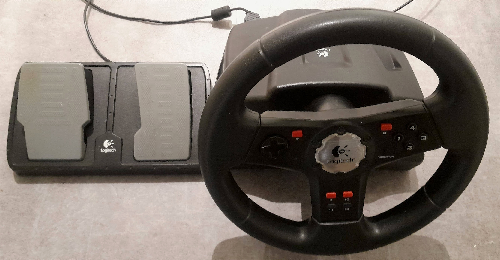

# Logitech Racing Wheel C++ driver



Compile with

```
cmake .
make
```

Run the demo:

```
./demo
```


## How to use

Include `logiwheel.h` into your project.

The class `LogiWheel` has four callbacks for throttle, braking, steering
and the buttons.

```
    void registerSteeringCallback(CallbackFunction cb)
    void registerThrottleCallback(CallbackFunction cb)
    void registerBrakeCallback(CallbackFunction cb)
    void registerButtonCallback(CallbackFunction cb)

```

where the first three callbacks need to be a standard function or lambda function receiving a float.
Braking and throttle are between 0 and 1. Steering between -1 and +1. The 4th callback needs
to receive an integer which then contain the index of the button which has been pressed.

Start the class with:
```
start();
```
and stop it with
```
stop();
```

## FastDDS broadcasting of the events

The subdirectory [remote_control](remote_control/) shows how to broadcast the steering wheel events, 
for example, to control a robot over a WIFI connection.

## Credit

Bernd Porr, mail@berndporr.me.uk
