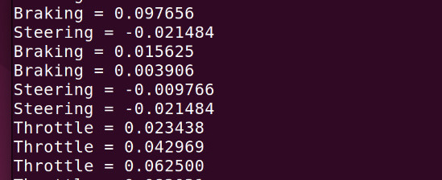

# Logitech Racing Wheel C++ driver

Compile with

```
cmake .
make
```

Run the demo:

```
./demo
```



## How to use

Include `logiwheel.h` into your project.

The class `LogiWheel` has three callbacks for throttle, braking and steering.

```
    void registerSteeringCallback(CallbackFunction cb)
    void registerThrottleCallback(CallbackFunction cb)
    void registerBrakeCallback(CallbackFunction cb)

```

where every callback needs to be a standard function or lambda function receiving a float.
Braking and throttle are between 0 and 1. Steering between -1 and +1.

Start the class with:
```
start();
```
and stop it with
```
stop();
```

## Credit: Bernd Porr, mail@berndporr.me.uk
